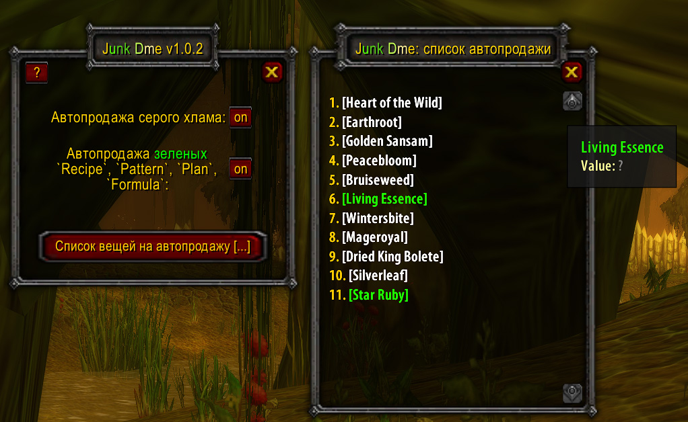
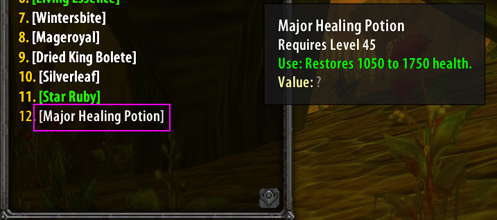
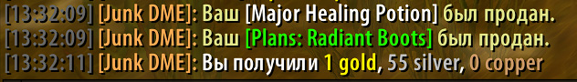

# Junk DME
Аддон для фарма. автопродажа выбранного мусора, лута, рецептов итд. В основном, писался для ускоренной продажи накапливающегося в сумках разнообразного мусора (цветы, рецепты...) при фарме цветов в Dire Maul(East) проекта Turtle-WOW.

# Основные команды:
- /jdme, /junkdme - вызов окна аддона
- /jdme help - вызов справки
- /jdme [ссылка на предмет] - занесение в список предмета на автопродажу вендору
# Доп. функции:
- атопродажа серого хлама. 
- атопродажа разного рода зеленых рецептов, патернов, формул и тд.
# Как работает
- Набираем команду: /jdme [ссылка на предмет]

- Находим в списке на автопродажу предмет, который добавили по команде.

- При открытии любого вендора\рембота эта вещь сразу продается.

# Обратная связь:
- По всем вопросам работы аддона обращаяйтесь к персонажу Casta, Madarra гильдии <a href="https://goingtodeath.ru/">"Going to Death"</a>. Проект Turtle-WOW.
